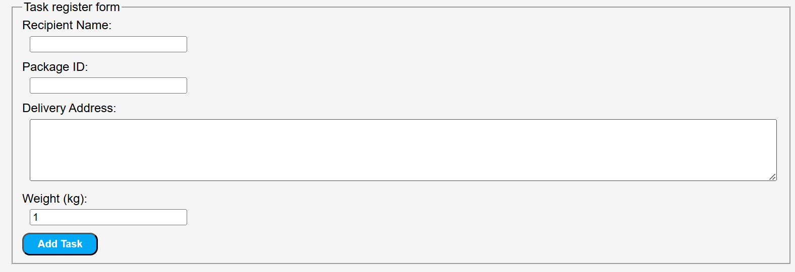

# JSville Courier Management System
This is JS Village's system for delivery management.

# how to use it

## add package

Enter the following information
All information is required.

- Recipient Name
    Name of the recipient of the delivery, only alphabetical characters are allowed.
- Package ID
    Delivery ID, only numbers can be entered.
- Delivery Address
    Shipping address.
- Weight
    The weight of the delivery item, starting from 1 kg.

After completing the entry of these information, you can press the button to register your delivery.

## package list

- Registered deliveries are added to a table at the bottom of the screen.
- Tracking Codes are automatically numbered from the information entered to keep track of deliveries.
- The table is always ordered by weight, and added deliveries are added in the same order.

